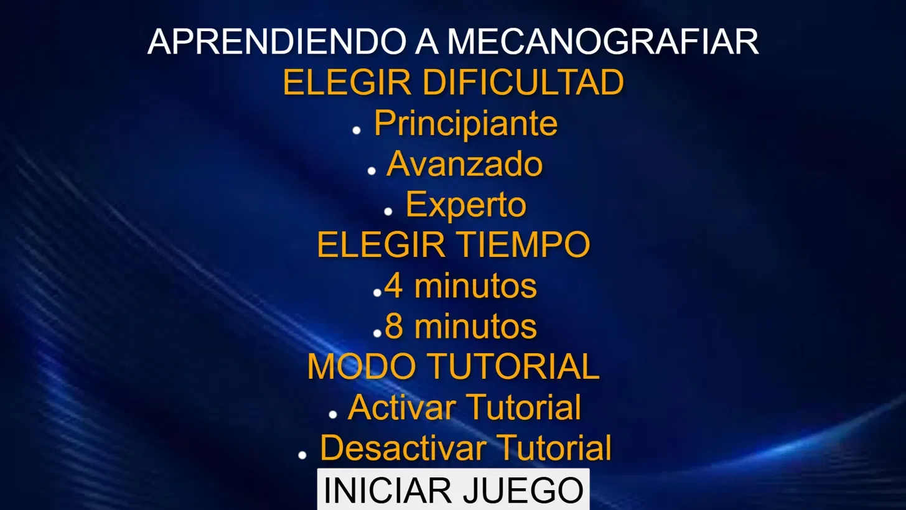
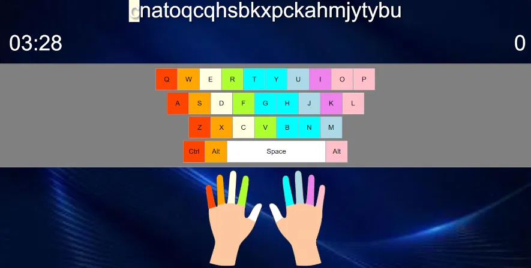

# Aprendiendo a Mecanografiar

Aplicación de escritorio interactiva para aprender y practicar mecanografía, desarrollada con Electron. Diseñada especialmente para personas con movilidad reducida en una mano, con una guía visual de dedos que indica qué dedo usar para cada tecla.

---

## ¿Por qué existe este proyecto?

Este proyecto nació de una necesidad personal. Su autor tiene hemiplejia izquierda congénita y quiso crear una herramienta que ayude a personas con la misma condición a aprender mecanografía de forma visual e intuitiva, sabiendo exactamente qué dedo usar en cada momento.

---

## Capturas de pantalla

### Menú principal


### Selección de dificultad


### Juego en acción — teclado con guía de colores y manos


---

## Funcionalidades

- **Guía visual de dedos**: cada tecla tiene un color asociado a un dedo específico, y una imagen de manos indica cuál usar en tiempo real
- **Teclado interactivo en pantalla**: resalta la tecla que debe presionarse
- **3 niveles de dificultad**: Principiante, Avanzado y Experto (con distintos tiempos por tecla)
- **2 modos de tiempo**: 4 minutos y 8 minutos por partida
- **Sistema de puntaje**: puntos por letra correcta y bonus por palabra completa
- **Tutorial interactivo**: guía paso a paso para nuevos usuarios, con timer pausado y teclado bloqueado
- **Autenticación de usuarios**: registro e inicio de sesión con contraseñas hasheadas con bcrypt
- **Top 10 de puntajes**: ranking global y ranking personal por usuario
- **Base de datos local**: SQLite por usuario, con copia automática al primer arranque
- **Instalador para Windows**: generado con electron-builder y NSIS

---

## Tecnologías utilizadas

- **Electron** — aplicación de escritorio multiplataforma
- **JavaScript** — lógica del juego y frontend
- **HTML / CSS** — interfaz de usuario
- **better-sqlite3** — base de datos local SQLite
- **bcryptjs** — hash seguro de contraseñas
- **electron-builder** — empaquetado e instalador Windows (.exe)

---

## Estructura del proyecto

```
aprendiendo-a-mecanografiar/
├── main/
│   ├── main.js          # Proceso principal de Electron
│   ├── db.js            # Inicialización de SQLite y funciones de usuario
│   ├── auth.ipc.js      # IPC para login y registro
│   ├── score.ipc.js     # IPC para guardar y consultar puntajes
│   └── preload.js       # Bridge seguro entre main y renderer
├── public/
│   ├── index.html       # Menú principal
│   ├── login.html       # Inicio de sesión
│   ├── register.html    # Registro de usuario
│   ├── opciones.html    # Selección de dificultad y tiempo
│   ├── juego.html       # Pantalla principal del juego
│   ├── Puntajes.html    # Tabla de puntajes
│   ├── css/             # Estilos por pantalla
│   ├── js/              # Lógica del juego, timer, puntajes, tutorial
│   └── img/             # Imagen de manos y fondo
├── screenshots/         # Capturas de pantalla
├── icon.ico             # Ícono de la aplicación
└── package.json
```

---

## Base de datos

SQLite con dos tablas:

**users**
| id | nombre | password |
|----|--------|----------|
| INTEGER PK | TEXT UNIQUE | TEXT (bcrypt hash) |

**scores**
| user_id | puntos | fecha | duracion | dificultad |
|---------|--------|-------|----------|------------|
| FK → users.id | INTEGER | TEXT | TEXT | TEXT |

---

## Cómo ejecutar el proyecto

### Requisitos
- Node.js 18 o superior

### Instalación

```bash
git clone https://github.com/PabDarling/aprendiendo-a-mecanografiar
cd aprendiendo-a-mecanografiar
npm install
npm start
```

---

## Trabajo Final de Ingeniería en Informática

Este proyecto fue desarrollado como Trabajo Final de la carrera **Ingeniería en Informática** en la Universidad Católica de Santiago del Estero (UCSE).
